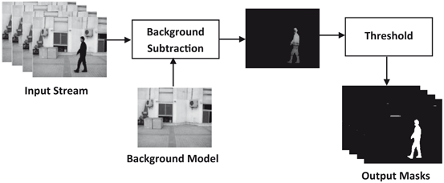
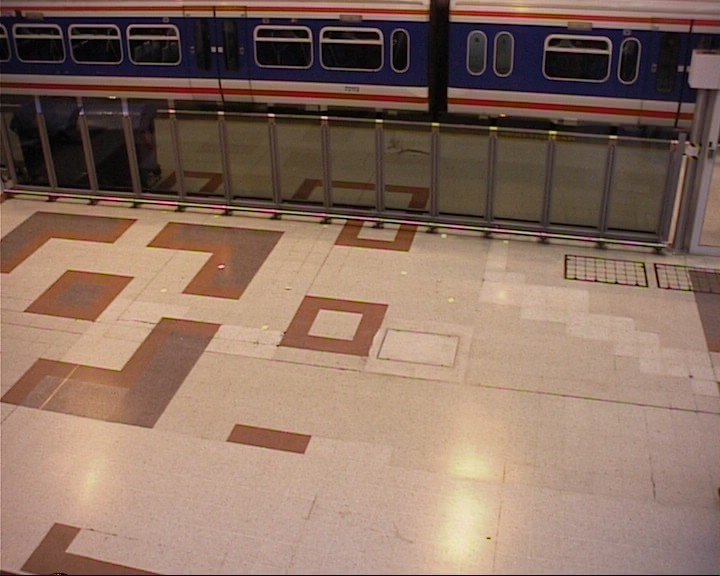
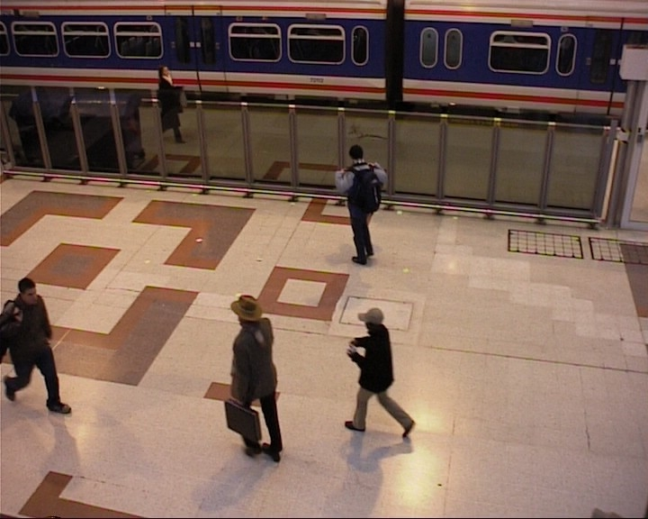
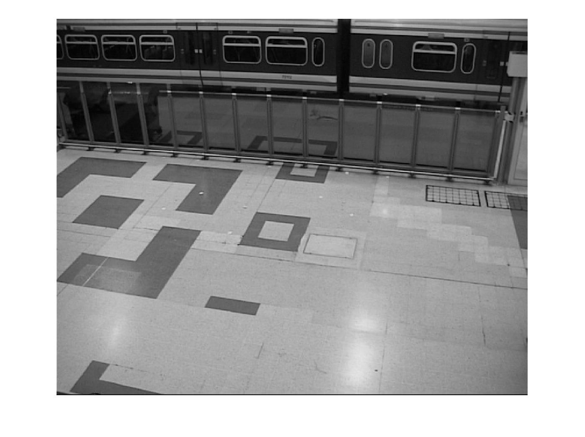
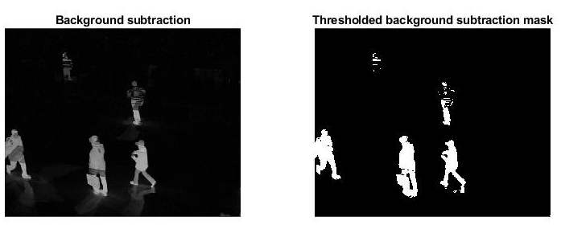
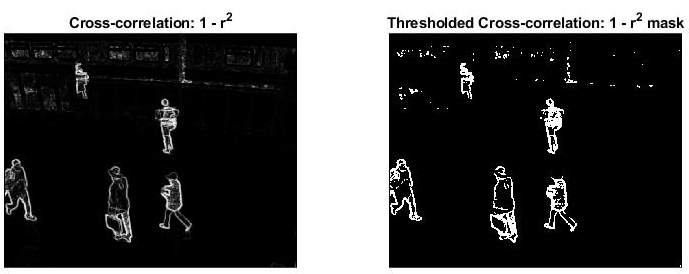
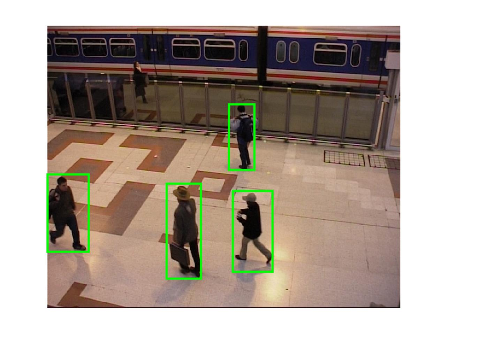
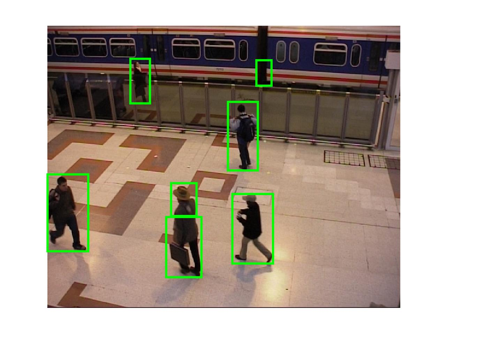

# People Detection from Fixed-Camera Imagery in Matlab

<tr>
    <td>  </td>
  </tr>
</table>

## 1. Objectives

The objective of this project is to demonstrate how to detect moving and stand-still people and other objects introduced to a scene monitored by a fixed-camera system. The implemented approach is based on the following 2 steps:

1.  Estimate the backgound image:
    * We explored four different background estimation techniques.
2. Estimate the change between the current foreground-frame image and the background image.
    * We explored two different change detcetion techniques. 
  
We shall compare the detection results using the different combinations of the implemented background estimation and change detection methods.

## 2. Data Set

We used the labelled PETS2006 baseline data subset from the ([dataset-2012](http://jacarini.dinf.usherbrooke.ca/dataset2012/)):
* It consists of 1200 color video frames of an indoor scene acquired by fixed camera. 
* A sample background and background images from the input data set are illustrated in figure below.
<table>
  <tr>
    <td>  </td>
    <td> </td>
   </tr> 
   <tr>
    <td align="center"> Frame # 1: Clear background </td>
    <td align="center"> Frame # 100: New objects (people) in the foreground. </td>
  </tr>
</table>

    
## 3. Implemented Approach

 Suppose that at time **t**, we introduce the following notations:
 * **F(t)**: The camera acquired frame.
 * **B(t)**: The estimated background image.
 * **C(t)**: The detected change image.
 
 The implemented people detection approach is based on the following 2 steps:

1. Estimate the backgound image: We explored four different background estimation techniques:
   * B(t): The first frame, prior to time t, which is known to contain only the scene background and no foreign objects temporarily introduced to the scene.
   * B(t): The last frame, prior to time t, for which no changes were detected, thus it should contain only the scene background and no foreign objects temporarily introduced to the scene.
   *  B(t): The average of all frames F(s), s<t, for which no changes were detected, thus it should contain only the scene background and no foreign objects temporarily introduced to the scene.
   * B(t): The average of all frames F(s), s<t.
2. Estimate the change between the current frame foreground image and the background: We explored two different change detection techniques. 
   * Absolute background subtraction: **C(t) = |F(t) - B(t)|**, where **|.|** indicate the absolute value.
   * The cross-correlation: **C(t) = 1 - [cc(F(t), B(t))]^2|**, where **cc(.,.)** indicate the cross-correlation between 2 images.
  
Next, we shall illusttate each of these techniques.
  
### 3.1 Background Estimation (BE)

In this section, we briefly illusttate the background estimation results using each of the four background subtraction estimation techniques, described above.
    
<table>
  <tr>
    <td align="center"> Bacground Estimation Method # 1 </td>
    <td align="center"> Bacground Estimation Method # 2 </td>
   </tr> 
   <tr>
    <td align="center"> </td>
    <td align="center"> </td>
  </tr>
   <tr>
    <td align="center"> Bacground Estimation Method # 3 </td>
    <td align="center"> Bacground Estimation Method # 4 </td>
   </tr> 
  <tr>
    <td align="center"> </td>
     <td align="center"> </td>
  </tr>
</table>

<table>
  <tr>
    <td align="center"> Absolute Background Subtraction </td>
    <td> </td>
   </tr> 
   <tr>
    <td align="center"> Inverted Cross-correlation </td>
    <td> </td>
   </tr> 
</table>

### 3.2 Change Detection (CD)

In this section, we illustrate the people detection results obtained using the:
* The 4 different background-estimation methods.
* The 2 different change detection methods.

<table>
  <tr>
     <td>  </td>
    <td CD: Background-Subtration> CD: Background-Subtration </td>
    <td CD: Background-Subtration> CD: Cross-Correlation </td>
  </tr>
  <tr>
    <td align="center"> BE: Method 1 </td>
    <td> </td>
    <td> </td>
  </tr>
  <tr>
    <td align="center"> BE: Method 2 </td>
    <td> </td>
    <td> </td>
  </tr>
  <tr>
    <td align="center"> BE: Method 3 </td>
    <td> </td>
    <td> </td>
  </tr>
  <tr>
    <td align="center"> BE: Method 4 </td>
    <td> </td>
    <td> </td>
  </tr>
</table>

### 3.3 Observations

In view of the presented results, we make the following observations:

* The bacground estimation approaches yield similar background images.
* The averaging bacground estimation methods average multiple images, resulting in reduction of the illumination variation effects.
* The cross corrrelation performance is comparable to the typically used background subtraction approach.

## 4. Future Work

To use the ground-truth of the labelled data set to assess the performance of the bacground estimation and change detection methods based on quantitative metrics, such as:

* ROC curves.
* PR curves.
* Detection accuracy and F1 score.

## 5. References

1. Change Detection.NET: A video databse for testing chnage detection algorithms. Retrieved from: 
http://jacarini.dinf.usherbrooke.ca/ (October 1st, 2022).

