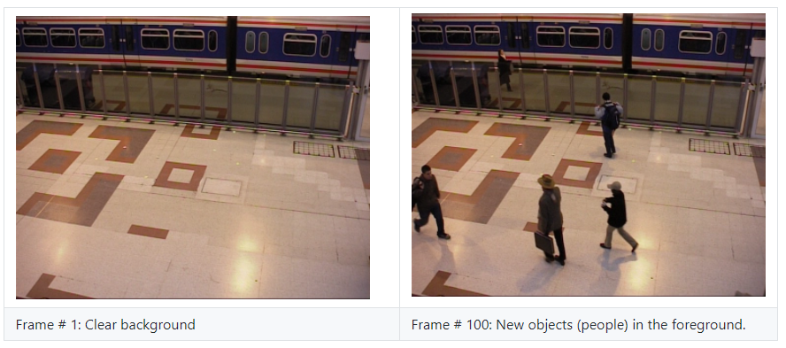

# People Detection from Fixed-Camera Imagery in Matlab

 

## 1. Objective

The objective of this project is to develop from scratch background estimation and subtraction and change detection algorithms in order to detect moving objects, such as people, from scene monitored by a fixed-camera system. 

* The implemented approach is based on the following 2 steps:

    * Estimate the background image:
    * We explored four different background estimation techniques.
    * Estimate the change between the current frame foreground image and the background.
    * We explored two different change detection techniques.

* We shall compare the detection results using the different combinations of the implemented background estimate and change detection techniques.

## 2. Approach

* Suppose that at time t, we introduce the following notations:

    * F(t): The camera acquired frame.
    * B(t): The estimated background image.
    * CD(t): The change detection image.
  
* The implemented people detection approach is based on the following 2 steps:

    1. Estimate the background image: We explored the four different background estimation techniques:
        * B(t): The first frame, prior to time t, which is known to contain only the scene background and no foreign objects temporarily introduced to the scene.
        * B(t): The last frame, prior to time t, for which no changes were detected, thus it should contain only the scene background and no foreign objects temporarily introduced to the scene.
        * B(t): The average of all frames F(s), s<t, for which no changes were detected, thus it should contain only the scene background and no foreign objects temporarily introduced to the scene.
        * B(t): The average of all frames F(s), s<t.

    2. Estimate the change CD(t) between the current frame foreground image and the background: 
        * We explored two different change detection techniques.
        * Absolute background subtraction: CD(t) = |F(t) - B(t)|, where |.| indicate the absolute value.
        * The inverted squared cross-correlation: CD(t) = 1 - [CC(F(t), B(t))]^2, where:
        * CC(.,.) indicate the pixel-based cross-correlation image between 2 images over local windows of size 7x7 pixels.

In section 4 we shall illustrate the development of these techniques.

## 3. Data
* We used the labelled PETS2006 baseline data subset from the dataset-2012 in [1]:

    * It consist of 1200 color video frames of an indoor scene acquired by fixed camera
    * A sample background and background images from the input data set are illustrated in figure below.

 

## 4. Development

The proposed background-estimation and change detection approaches outlined above were implemented from scratch in MATLAB

* Due to the relatively large size of the code, it will not be presented here.
* We shall illustrate and discuss sample results below.

## 5. Sample Results and Analysis

The MATLAB code for the implementation of our proposed approach outlined above is given in the Appendix below. We shall present and discuss sample results.

### 5.1 Background Estimation (BE)

* The figure below illustrate the background estimation results using each of the four background subtraction estimation techniques, described above, after processing 100 images:
    * After processing a sufficiently high number of frames, there is little different between the different methods
    * Averaging a sufficiently high number of frames suppresses the foreground changes, when there sufficiently infrequent
    * However, if there frequent changes and most of the averaged frames have foreground changes, then this will impact the background estimation method results based on averaging.
    * One of the advantages of using averaging is it suppresses the effects of illumination changes on the detection results.
    * It is recommended to use the third background subtraction method because it only average frames for which no foreground changes have been detected.

<table>
  <tr>
    <td align="center"> Bacground Estimation Method # 1 </td>
    <td align="center"> Bacground Estimation Method # 2 </td>
   </tr> 
   <tr>
    <td align="center"> </td>
    <td align="center"> </td>
  </tr>
   <tr>
    <td align="center"> Bacground Estimation Method # 3 </td>
    <td align="center"> Bacground Estimation Method # 4 </td>
   </tr> 
  <tr>
    <td align="center"> </td>
     <td align="center"> </td>
  </tr>
</table>

#$## 5.2 Change Detection (CD)

* The figure below illustrates the change detection using the two proposed methods for frame 100:

    * Absolute background subtraction: CD(t) = |F(t) - B(t)|, where |.| indicate the absolute value.
    * The inverted  squared cross-correlation: CD(t) = 1 - [CC(F(t), B(t))]^2, where:
        * CC(.,.) indicate the pixel-based cross-correlation image between 2 images over local windows of size 7x7 pixels.

<table>
  <tr>
    <td align="center"> Absolute Background Subtraction </td>
    <td> </td>
   </tr> 
   <tr>
    <td align="center"> Inverted Cross-correlation </td>
    <td> </td>
   </tr> 
</table>

### 5.2 Sample Change Detection (CD) Results

In this section, we illustrate the people detection results obtained using the:
* The 4 different background-estimation methods.
* The 2 different change detection methods.

<table>
  <tr>
     <td>  </td>
    <td CD: Background-Subtration> CD: Background-Subtration </td>
    <td CD: Background-Subtration> CD: Cross-Correlation </td>
  </tr>
  <tr>
    <td align="center"> BE: Method 1 </td>
    <td> </td>
    <td> </td>
  </tr>
  <tr>
    <td align="center"> BE: Method 2 </td>
    <td> </td>
    <td> </td>
  </tr>
  <tr>
    <td align="center"> BE: Method 3 </td>
    <td> </td>
    <td> </td>
  </tr>
  <tr>
    <td align="center"> BE: Method 4 </td>
    <td> </td>
    <td> </td>
  </tr>
</table>

### 5.4 Observations

In view of the presented results, we make the following observations:

* The bacground estimation approaches yield similar background images.
* The averaging bacground estimation methods average multiple images, resulting in reduction of the illumination variation effects.
* The cross corrrelation performance is comparable to the typically used background subtraction approach.

## 6. Future Work

To use the ground-truth of the labelled data set to assess the performance of the bacground estimation and change detection methods based on quantitative metrics, such as:

* ROC curves.
* PR curves.
* Detection accuracy and F1 score.

## 7. References

1. Change Detection.NET: A video databse for testing chnage detection algorithms. Retrieved from: 
http://jacarini.dinf.usherbrooke.ca/.

